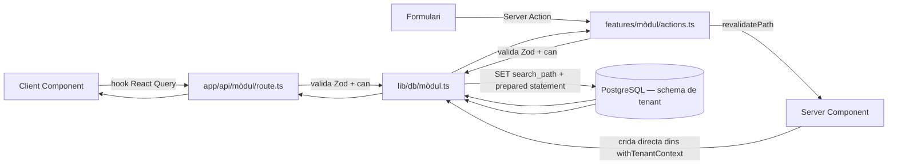

# Gestinmo — Arquitectura tècnica

Font de veritat de les decisions d'arquitectura. Generat a partir de
[`CLAUDE.md`](../CLAUDE.md) i [`docs/requirements.md`](requirements.md) per l'agent
Arquitecte. Els agents **UX Designer**, **Database Engineer**, **Auth Specialist**,
**API Engineer**, **UI Components**, **Feature Developer**, **State & Data**, **QA** i
**DevOps** han de seguir aquest document sense excepcions; qualsevol desviació ha de
tornar aquí abans d'implementar-se.

---

## 1. Decisions de stack

| Peça | Elecció | Per què | Implicacions |
|---|---|---|---|
| Framework | Next.js 15 (App Router) | Server Components + Server Actions eviten una capa d'API redundant per a mutacions de formulari; SSR ajuda al requisit de rendiment (< 500ms) en llistats paginats. | Cap agent introdueix Pages Router ni un backend separat: tot viu dins `src/app`. |
| UI | React 19 + Tailwind + shadcn/ui | React 19 (`useActionState`, `useFormStatus`) encaixa amb Server Actions sense llibreries de formularis addicionals. shadcn/ui dona primitives accessibles sense un sistema de disseny propietari a mantenir. | No s'afegeix cap altra llibreria de components (Material UI, Ant, etc.). No s'afegeix `react-hook-form`: la gestió de formularis és via Server Actions + `useActionState`. |
| Llenguatge | TypeScript `strict: true` | Domini amb muntants de diners, dates i estats: els errors de tipus s'han de detectar en build, no en producció. | Cap `any` explícit enlloc del codi; `unknown` + narrowing als límits (parsing de JSON, respostes externes). |
| BDD | PostgreSQL 16+ (Supabase com a proveïdor gestionat) | Schema-per-tenant necessita control total sobre `search_path` i DDL dinàmic per schema, cosa que el client d'alt nivell de Supabase no exposa còmodament. | Cap agent usa el client JS de Supabase per a dades de domini; només `pg` directe. Supabase s'usa només com a infraestructura (hosting de PostgreSQL, backups). |
| Accés BDD | `pg` directe, prepared statements | Multitenancy amb `SET search_path` per petició no és compatible amb un ORM que assumeixi un schema fix en temps de build. | Totes les queries a `src/lib/db/[domini].ts`; cap agent afegeix Prisma/Drizzle/Kysely. |
| Auth | JWT custom (`jose`) + `bcryptjs` | Cal codificar `tenant_id` i `rol` al token per resoldre el `search_path` abans de tocar BD; una solució d'auth gestionada (Supabase Auth, NextAuth) no dona aquest control directe sobre el payload ni sobre l'aïllament per schema. | Un únic mòdul (`src/lib/auth/`) concentra tota la lògica de token/contrasenya; cap altre fitxer hi accedeix directament. |
| Validació | Zod | Font única de veritat de tipus + validació en temps d'execució als límits del sistema (API, Server Actions). | Els tipus de domini (`Propietat`, `Contracte`, ...) s'infereixen amb `z.infer`, no es declaren dues vegades. |
| Dades client | TanStack React Query v5 | Cal caché, invalidació i optimistic updates per a accions freqüents (cobrar un rebut, canviar estat d'incidència) sense reinventar-los. | Els components client no fan `fetch` directe fora dels hooks generats per l'agent State & Data. |
| Tests | Vitest + Testing Library | Integració nativa amb l'ecosistema Vite/Next, ràpid en CI. | Cap altre framework de test (Jest, Playwright per a unitaris) s'introdueix sense revisar aquest document. |
| Deploy | Vercel | Integració nativa amb Next.js (Server Components, Server Actions, Edge Middleware) i amb GitHub per a preview deployments. | El middleware d'autenticació (§7) ha de funcionar en Edge Runtime: no pot obrir connexions directes a PostgreSQL. |
| CI/CD | GitHub Actions | Ja és on viu el repositori; evita dependre d'una eina de CI externa addicional. | Vegeu `docs/agents/AGENT_DEVOPS.md` per al pipeline exacte. |

**Multitenancy — per què schema-per-tenant i no una columna `tenant_id` a totes les
taules amb RLS:** els requisits (§4) exigeixen aïllament total i auditable entre
agències. Un schema separat per tenant fa estructuralment impossible una fuita de dades
per un `WHERE tenant_id = ...` oblidat en una query — l'aïllament no depèn de disciplina
de codi a cada query de domini. El cost (DDL dinàmic, provisioning més complex) es
considera acceptable donada la naturalesa sensible de les dades (contractes, dades
personals, informació econòmica).

---

## 2. Estructura de carpetes `src/`

```
src/
├── middleware.ts                      # protecció de rutes (Agent Auth Specialist)
├── app/
│   ├── (auth)/
│   │   ├── layout.tsx                 # sense navegació de dashboard
│   │   └── login/page.tsx
│   ├── (dashboard)/
│   │   ├── layout.tsx                 # navegació, resol tenant/rol, menú segons matriu de permisos
│   │   ├── page.tsx                   # redirect a /informes (dashboard per defecte)
│   │   ├── propietats/
│   │   │   ├── page.tsx               # llistat
│   │   │   ├── nou/page.tsx           # creació
│   │   │   └── [id]/page.tsx          # detall/edició
│   │   ├── propietaris/{page.tsx, nou/page.tsx, [id]/page.tsx}
│   │   ├── inquilins/{page.tsx, nou/page.tsx, [id]/page.tsx}
│   │   ├── contractes/{page.tsx, nou/page.tsx, [id]/page.tsx}
│   │   ├── pagaments/{page.tsx, [id]/page.tsx, remeses/page.tsx}
│   │   ├── incidencies/{page.tsx, nou/page.tsx, [id]/page.tsx}
│   │   ├── informes/page.tsx          # dashboard analític
│   │   └── configuracio/page.tsx      # només admin: tenant, usuaris
│   ├── (portal)/                      # Portal del llogater — fase final, vegeu §9
│   └── api/
│       ├── propietats/{route.ts, [id]/route.ts}
│       ├── propietaris/{route.ts, [id]/route.ts}
│       ├── inquilins/{route.ts, [id]/route.ts}
│       ├── contractes/{route.ts, [id]/route.ts}
│       ├── pagaments/{route.ts, [id]/route.ts, remeses/route.ts}
│       ├── incidencies/{route.ts, [id]/route.ts}
│       └── informes/{dashboard/route.ts, [recurs]/export/route.ts}
├── components/
│   ├── ui/                            # primitives shadcn/ui
│   └── shared/                        # DataTable, StatusBadge, EmptyState, ErrorState, ConfirmDialog, FormField...
├── features/
│   └── [modul]/                       # propietats, propietaris, inquilins, contractes, pagaments, incidencies, informes
│       ├── components/                # components propis del mòdul
│       ├── hooks/                     # React Query (Agent State & Data)
│       ├── actions.ts                 # Server Actions de mutació
│       └── types.ts
├── lib/
│   ├── db/
│   │   ├── pool.ts                    # pool de connexions pg
│   │   ├── propietats.ts, persones.ts, contractes.ts, pagaments.ts, incidencies.ts, informes.ts
│   ├── auth/
│   │   ├── jwt.ts, password.ts, session.ts, tenant-context.ts, rbac.ts
│   ├── validations/
│   │   ├── propietats.ts, persones.ts, contractes.ts, pagaments.ts, incidencies.ts
│   ├── logger.ts
│   └── errors.ts
└── types/
    └── index.ts                       # tipus compartits que no deriven d'un schema Zod
```

**Regla de propietat de directoris** (per evitar solapaments entre agents):

| Directori | Agent propietari |
|---|---|
| `src/middleware.ts`, `src/lib/auth/**` | Auth Specialist |
| `src/app/api/**`, `src/lib/db/**`, `src/lib/validations/**` | API Engineer |
| `src/components/ui/**`, `src/components/shared/**` | UI Components |
| `src/features/[modul]/components|actions.ts|types.ts`, `src/app/(dashboard)/**` | Feature Developer |
| `src/features/[modul]/hooks/**` | State & Data |
| `src/lib/logger.ts`, `src/lib/errors.ts`, `src/types/**` | Arquitecte (aquest document en defineix el contracte; qualsevol agent hi pot afegir tipus/helpers seguint-lo) |

El **Portal del llogater** ((portal), mòdul 3.9 de `docs/requirements.md`) es reserva
una carpeta pròpia amb `layout.tsx` i autenticació separada. No es desenvolupa en
aquesta primera passada — vegeu §9.

---

## 3. Convencions de Next.js App Router

- **Route groups**: `(auth)` (login, sense navegació), `(dashboard)` (aplicació interna,
  requereix JWT vàlid amb rol `admin`/`gestor`/`comptable`), `(portal)` (fase final,
  requereix credencials de llogater, separades de `tenant_users`).
- **`layout.tsx`**: cada route group té el seu propi layout arrel. El de `(dashboard)`
  resol la sessió i el rol una única vegada i el propaga via context de React Server
  Components (no via prop drilling manual a cada pàgina).
- **`loading.tsx`**: obligatori a cada segment que faci una consulta que pugui trigar
  (llistats, detall) — mostra l'`LoadingSkeleton` d'`docs/agents/AGENT_UI_COMPONENTS.md`,
  mai un spinner genèric sense forma.
- **`error.tsx`**: obligatori a cada segment de `(dashboard)` — captura errors inesperats
  de renderitzat/fetch i mostra l'`ErrorState`, amb acció de reintentar.
- **`not-found.tsx`**: per a detalls d'entitat amb `id` inexistent (`404` intencionat,
  no un error).
- **Route handler vs Server Action**: un **route handler** (`app/api/**`) és per a
  qualsevol endpoint consumit per **TanStack React Query** al client, o per
  integracions externes (exports CSV/PDF). Una **Server Action** (`features/[modul]/actions.ts`)
  és per a mutacions disparades directament des d'un formulari renderitzat al servidor.
  Mai es duplica lògica entre tots dos: la Server Action i el route handler equivalent
  criden la mateixa funció de `src/lib/db/[domini].ts`.
- **Metadata**: `generateMetadata` per pàgina amb títol coherent amb el mòdul;
  `lang="ca"` fixat a `app/layout.tsx` arrel.
- **Revalidació**: les Server Actions que muten dades criden `revalidatePath` sobre la
  ruta de llistat i de detall afectades; no es fa `router.refresh()` manual des del
  client per a aquest cas.

---

## 4. Server Components vs Client Components

**Per defecte, Server Component.** Un component només és Client Component
(`'use client'`) quan necessita com a mínim una d'aquestes coses:

- Estat local (`useState`, `useReducer`).
- Efectes (`useEffect`).
- Event handlers interactius (`onClick`, `onChange`, ...) que no es poden expressar com
  a Server Action directa sobre un `<form>`.
- Hooks de React Query (Agent State & Data).
- APIs només disponibles al navegador (`localStorage`, `window`, ...).

**Regla de fulla**: el `'use client'` es col·loca al component més petit i profund
possible (el botó, el camp de formulari, el diàleg de confirmació), mai a la pàgina
sencera. Una pàgina de llistat és Server Component encara que contingui una taula amb
ordenació interactiva: només la cel·la/capçalera que gestiona l'ordenació és client.

**Pas de dades Server → Client**: només props serialitzables (JSON-compatibles, dates
com a `string` ISO, mai objectes de connexió a BD, funcions no serialitzades, ni el JWT
sencer — com a màxim `tenant_id` i `rol` ja resolts). Els Server Components poden
consultar `src/lib/db/[domini].ts` directament (dins de `withTenantContext`, §7); els
Client Components mai ho fan — usen els hooks de l'Agent State & Data, que criden
`app/api/**`.

**Formularis**: `<form action={serverAction}>` amb `useActionState` al Client Component
mínim que envolta el formulari, per mostrar estat d'enviament i errors de validació
camp a camp.

---

## 5. Gestió d'errors

### 5.1 Format estàndard de resposta d'API (`app/api/**`)

```ts
// èxit
type ApiSuccess<T> = { data: T; meta?: { page: number; pageSize: number; total: number } };

// error
type ApiError = {
  error: {
    code: 'VALIDATION_ERROR' | 'UNAUTHORIZED' | 'FORBIDDEN' | 'NOT_FOUND'
        | 'CONFLICT' | 'INTERNAL_ERROR';
    message: string;
    fields?: Record<string, string>; // detall per camp, ex: sortida de Zod .flatten()
  };
};
```

Helpers centralitzats a `src/lib/errors.ts` (`apiError(code, message, fields?)`,
`apiSuccess(data, meta?)`) perquè cap route handler construeixi l'envelope a mà.

### 5.2 Codis HTTP

| Codi | Ús |
|---|---|
| 400 | Validació Zod fallida |
| 401 | No autenticat (token absent/invàlid/expirat/sessió revocada) |
| 403 | Autenticat però sense permís segons la matriu de rols (`docs/requirements.md` §2.2) |
| 404 | Recurs no trobat (o pertanyent a un altre tenant — mai es distingeix la resposta entre "no existeix" i "no és teu") |
| 409 | Conflicte amb una regla de negoci (ex: violació de `contractes_unitat_actiu_idx`, suma de percentatges de titularitat ≠ 100) — la capa d'API tradueix l'excepció de PostgreSQL a un missatge llegible, mai exposa el detall intern del driver |
| 500 | Error inesperat — es registra amb `logger.error` (§6) i es retorna un missatge genèric |

### 5.3 Server Actions

Retornen un objecte d'estat compatible amb `useActionState`, mai llencen una excepció no
controlada cap al client:

```ts
type ActionState =
  | { status: 'idle' }
  | { status: 'success'; data: unknown }
  | { status: 'error'; message: string; fields?: Record<string, string> };
```

### 5.4 UI

`error.tsx` per segment (§3) per a errors de renderitzat/fetch inesperats.
`docs/ux-flows.md` (Agent UX) defineix els missatges concrets mostrats a l'usuari per a
cada `code`/regla de negoci; aquest document només fixa el contracte tècnic que aquells
missatges han de consumir.

---

## 6. Logging

### 6.1 Nivells

| Nivell | Ús |
|---|---|
| `debug` | Detall de desenvolupament, desactivat en producció per defecte |
| `info` | Esdeveniments normals rellevants (login correcte, tenant provisionat) |
| `warn` | Situacions recuperables però anòmales (intent de login fallit, rebuig 403/409) |
| `error` | Excepcions no esperades (500), sempre amb `stack` i context de la petició |

### 6.2 Format

JSON estructurat via `src/lib/logger.ts` (`logger.info(msg, context)`, etc.), amb com a
mínim: `timestamp`, `level`, `message`, `requestId` (generat per petició, propagat als
logs d'una mateixa transacció HTTP), `tenantId` (si ja resolt), mai el JWT sencer ni el
`password_hash`.

### 6.3 Què no es loguetja mai

Contrasenyes (en cap forma), tokens JWT complets, IBAN complet (es pot loguejar
truncat/emmascarat si cal per a diagnòstic), NIF/dades personals d'inquilins més enllà
del seu `id` — coherent amb el requisit RGPD de `docs/requirements.md` §4.

### 6.4 Logging tècnic vs. auditoria de negoci

Són coses diferents i **no s'han de confondre**:
- **Logging tècnic** (`src/lib/logger.ts`) — per a diagnòstic d'incidents d'infraestructura;
  rotatiu, pot no persistir indefinidament, viu fora de PostgreSQL (stdout capturat per
  Vercel).
- **Auditoria de negoci** (taula `auditoria` de `docs/db-schema.md`, alimentada per
  triggers de BD) — registre permanent i legal de qui ha modificat què, exigit pel
  requisit no funcional d'auditoria. Cap agent ha de intentar substituir l'auditoria de
  BD per logging d'aplicació, ni a l'inrevés.

---

## 7. Multitenancy a nivell d'aplicació

Aquest és el contracte que **Auth Specialist**, **API Engineer** i **Database
Engineer** han de complir sense divergències:

1. El `tenant_id` d'una petició es resol **únicament** a partir del JWT verificat
   (`payload.tenant_id`), mai d'un paràmetre de ruta o query string sense contrastar-lo
   contra el token.
2. Abans de qualsevol query de domini, s'obre una transacció que fixa:
   ```sql
   SET LOCAL search_path TO tenant_<uuid>, public;
   SET LOCAL app.tenant_id = '<uuid>';
   SET LOCAL app.current_user_id = '<tenant_user_id>';
   ```
   Aquest patró es concentra en una única funció (`withTenantContext`, a
   `src/lib/auth/tenant-context.ts`, responsabilitat de l'Auth Specialist): cap altra
   part del codi fixa `search_path` manualment.
3. El `tenant_id` es valida com a UUID **abans** d'interpolar-lo en el nom de l'schema
   (encara que sigui via `format()` parametritzat de `pg`): mai concatenació directa
   d'un valor no verificat en una sentència DDL/DML.
4. Els route handlers i Server Actions reben sempre el `payload` del JWT ja verificat
   pel middleware/helper d'autenticació; no re-verifiquen el token, però sí criden
   `can(rol, modul, accio)` (RBAC, `src/lib/auth/rbac.ts`) abans d'executar cap operació.
5. Una resposta `404` es retorna igual tant si un recurs no existeix com si pertany a un
   altre tenant: mai es filtra informació sobre l'existència de dades d'altres agències.

---

## 8. Flux de dades



Dos camins d'escriptura (route handler i Server Action) conflueixen sempre a la mateixa
funció de `src/lib/db/[domini].ts`: no hi ha lògica de domini duplicada entre tots dos.

---

## 9. Decisions pendents / fora d'abast

- **Portal del llogater** (`docs/requirements.md` §3.9): es reserva el route group
  `(portal)` i un mecanisme d'autenticació separat de `tenant_users` (credencials
  pròpies per persona amb `tipus = 'inquili'`), amb un `rol` diferenciat al JWT. Es
  dissenyarà en detall quan s'aborni aquesta fase — no bloqueja cap altre mòdul.
- **Notificacions per email** (rebuts vençuts, respostes a incidències del portal):
  proveïdor concret (Resend, SES, ...) no decidit; queda fora d'abast d'aquesta primera
  passada d'arquitectura.
- **Internacionalització** més enllà del català: `docs/requirements.md` §4 la marca com
  a no requerida en aquesta fase; l'estructura de `src/app` no inclou `[locale]` per no
  introduir complexitat prematura.
- **pg_cron per a `marcar_pagaments_vencuts()`** (`docs/db-schema.md` §6): la
  programació concreta (pg_cron vs. job extern de GitHub Actions/Vercel Cron) és
  responsabilitat de l'Agent DevOps, no d'aquest document.
