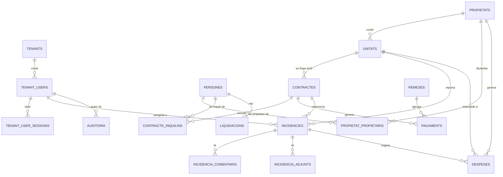

# Gestinmo — Esquema de base de dades

Font de veritat de l'esquema PostgreSQL. Generat a partir de [`CLAUDE.md`](../CLAUDE.md) i
[`docs/requirements.md`](requirements.md) per l'agent Database Engineer. Els agents **API
Engineer** i **Auth Specialist** han de llegir aquest document abans d'escriure cap query.

---

## 1. Estratègia multitenancy: schema-per-tenant

```
public.tenants          -- agències registrades (metadades globals)
public.tenant_users     -- usuaris interns i el seu tenant/rol
public.tenant_user_sessions -- sessions JWT (revocació/expiració)

tenant_{uuid}.propietats
tenant_{uuid}.unitats
tenant_{uuid}.persones
tenant_{uuid}.contractes
tenant_{uuid}.pagaments
...
```

Cada agència (tenant) té el seu propi schema PostgreSQL, `tenant_{uuid}`, amb una còpia
completa de les taules de domini. Les úniques taules que conviuen entre totes les
agències són les de `public` (tenants, usuaris interns i sessions).

### 1.1 Com estan escrites les migracions

- **`001_tenants.sql`, `002_auth.sql`, `010_rls.sql`** — qualifiquen totes les taules com
  a `public.*` explícitament. S'executen **una única vegada**, en el desplegament inicial.
- **`003_propietats.sql` a `008_auditoria.sql`** — defineixen taules **sense qualificar
  l'schema** (`CREATE TABLE IF NOT EXISTS propietats (...)`, no `tenant_xxx.propietats`).
  Depenen del `search_path` actiu de la connexió. **No s'executen mai contra `public`**:
  només s'executen quan es provisiona un tenant nou, amb el `search_path` apuntant al seu
  schema.
- **`009_indexes.sql`** — mixt: primer bloc qualificat (`public.*`), segon bloc sense
  qualificar (schema de tenant).

Aquest disseny és el que demana `AGENT_DATABASE.md`: *"Cada migració ha de funcionar
tant per al schema `public` com per als schemas de tenant. Usa la variable `search_path`
o qualifica les taules amb el schema explícit."*

### 1.2 Provisioning d'un tenant nou

Seqüència que ha d'implementar l'agent API/Auth a `src/lib/db/tenants.ts` (fora de
l'abast d'aquest agent):

```sql
-- 1. Alta del tenant (schema public)
INSERT INTO public.tenants (nom, slug) VALUES ('Agència Exemple', 'agencia-exemple')
  RETURNING id;
-- suposem id = 3f2a...

-- 2. Crear l'schema del tenant
CREATE SCHEMA IF NOT EXISTS tenant_3f2a...;

-- 3. Apuntar-hi el search_path per a la resta de la sessió/transacció
SET search_path TO tenant_3f2a..., public;

-- 4. Executar seqüencialment 003_propietats.sql .. 009_indexes.sql (secció de tenant)
--    contra aquesta connexió. Totes les CREATE TABLE/TYPE/INDEX aterren a tenant_3f2a...
```

A partir d'aquí, cada petició autenticada d'aquest tenant ha de fer, a l'inici de la
transacció:

```sql
SET LOCAL search_path TO tenant_{uuid}, public;
SET LOCAL app.tenant_id = '{uuid}';       -- usat per les polítiques RLS de public (010_rls.sql)
SET LOCAL app.current_user_id = '{uuid}'; -- usat per la funció d'auditoria (008_auditoria.sql)
```

### 1.3 Nota de seguretat

`incidencies.assignat_a`, `incidencia_comentaris.autor_usuari_id` i
`auditoria.usuari_id` referencien `public.tenant_users(id)` amb una FK normal (no hi ha
manera d'expressar "mateix tenant" amb una FK entre un schema de tenant i la taula
global d'usuaris). **La capa d'aplicació és responsable de verificar que
`tenant_users.tenant_id` coincideix amb el tenant actiu abans d'assignar un usuari a
una incidència o d'escriure `app.current_user_id`.**

---

## 2. Diagrama ER



`PROPIETATS`, `UNITATS`, `PERSONES`, `PROPIETAT_PROPIETARIS`, `CONTRACTES`,
`CONTRACTE_INQUILINS`, `REMESES`, `PAGAMENTS`, `LIQUIDACIONS`, `INCIDENCIES`,
`INCIDENCIA_COMENTARIS`, `INCIDENCIA_ADJUNTS`, `AUDITORIA` i `DESPESES` viuen dins de
cada schema `tenant_{uuid}`. `TENANTS`, `TENANT_USERS` i `TENANT_USER_SESSIONS` viuen a
`public`.

---

## 3. Taules

### 3.1 `public.tenants` — 001_tenants.sql

| Camp | Tipus | Notes |
|---|---|---|
| id | UUID PK | |
| nom | TEXT NOT NULL | |
| slug | TEXT UNIQUE NOT NULL | Identificador curt de l'agència |
| pla | TEXT NOT NULL DEFAULT 'basic' | |
| configuracio | JSONB NOT NULL DEFAULT '{}' | Preferències/paràmetres lliures del tenant |
| jwt_expiracio_minuts | INTEGER NOT NULL DEFAULT 60 | Requisit no funcional: JWT amb expiració configurable per tenant |
| actiu | BOOLEAN NOT NULL DEFAULT true | |
| created_at / updated_at | TIMESTAMPTZ | |

### 3.2 `public.tenant_users` — 002_auth.sql

| Camp | Tipus | Notes |
|---|---|---|
| id | UUID PK | |
| tenant_id | UUID FK → tenants | |
| email | TEXT NOT NULL | Únic per tenant (`UNIQUE(tenant_id, email)`) |
| password_hash | TEXT NOT NULL | `bcryptjs`, mai text pla |
| nom / cognoms | TEXT | |
| rol | ENUM `rol_usuari` | `admin`, `gestor`, `comptable` |
| actiu | BOOLEAN NOT NULL DEFAULT true | Usuari desactivat no pot iniciar sessió |
| intents_fallits | INTEGER NOT NULL DEFAULT 0 | Bloqueig per intents fallits |
| bloquejat_fins | TIMESTAMPTZ | |
| ultim_login | TIMESTAMPTZ | |
| created_at / updated_at / deleted_at | TIMESTAMPTZ | |

El **Portal llogater** (rol extern) **no** és un `tenant_users`: és un usuari amb
credencials pròpies, fora d'abast d'aquesta primera passada — vegeu secció 8.

### 3.3 `public.tenant_user_sessions` — 002_auth.sql

Modela l'entitat `Sessio` dels requisits (3.1). Estats derivats (no emmagatzemats com a
columna, sinó calculats):

| Estat | Condició |
|---|---|
| activa | `revoked_at IS NULL AND expires_at > now()` |
| expirada | `expires_at <= now()` |
| revocada | `revoked_at IS NOT NULL` |

| Camp | Tipus | Notes |
|---|---|---|
| id | UUID PK | |
| tenant_user_id | UUID FK → tenant_users | |
| token_jti | TEXT UNIQUE NOT NULL | Identificador del JWT (`jti` claim) |
| ip_address | INET | |
| user_agent | TEXT | |
| created_at / expires_at / revoked_at | TIMESTAMPTZ | |

### 3.4 `propietats` — 003_propietats.sql (schema de tenant)

| Camp | Tipus | Notes |
|---|---|---|
| id | UUID PK | |
| referencia | TEXT UNIQUE NOT NULL | |
| tipus | ENUM `tipus_propietat` | `edifici`, `casa`, `pis`, `local`, `solar`, `altres` |
| adreca | TEXT NOT NULL | |
| poblacio / cp | TEXT | |
| superficie | NUMERIC(10,2) | |
| habitacions / banys | INTEGER | |
| ascensor | BOOLEAN NOT NULL DEFAULT false | |
| cert_energetic | TEXT | |
| notes | TEXT | |
| created_at / updated_at / deleted_at | TIMESTAMPTZ | Soft delete |

**Sense** `propietari_id`: la titularitat es modela amb la taula N:N
`propietat_propietaris` (secció 3.5) perquè els requisits (3.3) permeten copropietat amb
percentatges. Aquesta és una desviació deliberada respecte a la llista de camps mínima
d'`AGENT_DATABASE.md`, justificada per la regla de negoci "una propietat pot tenir més
d'un propietari amb percentatge de titularitat que ha de sumar 100%".

### 3.5 `unitats` — 003_propietats.sql (schema de tenant)

| Camp | Tipus | Notes |
|---|---|---|
| id | UUID PK | |
| propietat_id | UUID FK → propietats | `ON DELETE RESTRICT` |
| referencia | TEXT NOT NULL | Únic per propietat |
| planta / porta | TEXT | |
| superficie | NUMERIC(10,2) | |
| renda_base | NUMERIC(10,2) | |
| estat | ENUM `estat_unitat` | `vacant`, `ocupat`, `reservat`, `manteniment`, `baixa` |
| created_at / updated_at / deleted_at | TIMESTAMPTZ | |

L'estat es sincronitza automàticament: `vacant → ocupat` en activar-se un contracte,
`ocupat → vacant` en finalitzar/resoldre's (trigger `sync_estat_unitat`, definit a
005_contractes.sql). **No s'edita manualment mentre hi hagi un contracte actiu.**

### 3.6 `persones` — 004_persones.sql (schema de tenant)

| Camp | Tipus | Notes |
|---|---|---|
| id | UUID PK | |
| tipus | ENUM `tipus_persona` | `propietari`, `inquili`, `empresa` |
| nom | TEXT NOT NULL | |
| cognoms / telefon / adreca / notes | TEXT | Sense xifrar |
| nif_enc | BYTEA | NIF/CIF xifrat amb `pgcrypto` (`pgp_sym_encrypt`) — vegeu §7 |
| nif_hash | TEXT | HMAC-SHA256 determinista del NIF, usat per cerca/unicitat (mai desxifrat) |
| email_enc | BYTEA | Email de contacte xifrat |
| iban_enc | BYTEA | IBAN xifrat |
| estat_inquili | ENUM `estat_inquili` | `actiu`, `moros`, `inactiu`; `NOT NULL` només si `tipus = 'inquili'` |
| created_at / updated_at / deleted_at | TIMESTAMPTZ | |

`nif`, `iban` i `email` **no es guarden en clar** (§7 "Seguretat de base de dades").
NIF únic per tenant entre persones no donades de baixa, aplicat sobre el hash
(`persones_nif_hash_actiu_unique`, índex parcial sobre `nif_hash`) perquè el xifratge
no és determinista i no es pot indexar/comparar per igualtat directament sobre
`nif_enc`.

> Nota: `public.tenant_users.email` (login intern) **no** es xifra — ha de romandre
> consultable per igualtat per a l'autenticació. El camp sensible protegit aquí és
> l'email de contacte de `persones` (propietaris/inquilins/empreses), no les
> credencials d'accés.

### 3.7 `propietat_propietaris` — 004_persones.sql (schema de tenant)

Copropietat: relació N:N entre `propietats` i `persones` (tipus `propietari`).

| Camp | Tipus | Notes |
|---|---|---|
| propietat_id | UUID FK → propietats | PK composta |
| persona_id | UUID FK → persones | PK composta |
| percentatge | NUMERIC(5,2) | `> 0` i `<= 100` |
| created_at / updated_at | TIMESTAMPTZ | |

Un *constraint trigger* diferit (`trg_check_percentatge_titularitat`) valida en cada
`COMMIT` que la suma de `percentatge` per `propietat_id` sigui exactament 100.

### 3.8 `contractes` — 005_contractes.sql (schema de tenant)

| Camp | Tipus | Notes |
|---|---|---|
| id | UUID PK | |
| unitat_id | UUID FK → unitats | `ON DELETE RESTRICT` |
| tipus_us | ENUM `tipus_us_contracte` | `habitatge`, `local`, `parking`, `industrial`, `altres` |
| data_inici | DATE NOT NULL | |
| data_fi | DATE | `> data_inici` si informada |
| renda | NUMERIC(10,2) | `> 0` |
| fianca | NUMERIC(10,2) | `>= 0`; entre 1 i 2 mensualitats només si `tipus_us = 'habitatge'` |
| index_actualitzacio | TEXT NOT NULL DEFAULT 'IPC' | |
| percentatge_pactat | NUMERIC(5,2) | Usat quan l'índex és un percentatge fix pactat |
| estat | ENUM `estat_contracte` | `esborrany`, `actiu`, `finalitzat`, `resolt` |
| document_url | TEXT | |
| motiu_resolucio / data_resolucio | TEXT / DATE | |
| created_at / updated_at / deleted_at | TIMESTAMPTZ | |

Els propietaris d'un contracte **no** es guarden de forma redundant: es deriven
transitivament `unitat → propietat → propietat_propietaris`.

### 3.9 `contracte_inquilins` — 005_contractes.sql (schema de tenant)

N:N entre `contractes` i `persones` (tipus `inquili`) — un contracte pot tenir més d'un
inquilí (ex: parella, companys de pis).

### 3.10 `remeses` — 006_pagaments.sql (schema de tenant)

| Camp | Tipus |
|---|---|
| id | UUID PK |
| referencia | TEXT UNIQUE NOT NULL |
| data_generacio | DATE NOT NULL DEFAULT current_date |
| data_enviament | DATE |
| created_at / updated_at | TIMESTAMPTZ |

### 3.11 `pagaments` — 006_pagaments.sql (schema de tenant)

| Camp | Tipus | Notes |
|---|---|---|
| id | UUID PK | |
| contracte_id | UUID FK → contractes | `ON DELETE RESTRICT` |
| remesa_id | UUID FK → remeses | Opcional |
| concepte | TEXT NOT NULL DEFAULT 'Lloguer' | |
| import | NUMERIC(10,2) | `> 0` |
| data_venciment | DATE NOT NULL | |
| data_cobrament | DATE | Només si `estat IN ('cobrat','regularitzat')` |
| metode | ENUM `metode_pagament` | `domiciliacio`, `transferencia`, `efectiu`, `targeta`, `altres` |
| estat | ENUM `estat_pagament` | `pendent`, `remesa`, `cobrat`, `vencut`, `mora`, `regularitzat` |
| created_at / updated_at / deleted_at | TIMESTAMPTZ | Mai `DELETE` físic d'un rebut cobrat; s'anul·la (soft delete) amb rastre d'auditoria |

### 3.12 `liquidacions` — 006_pagaments.sql (schema de tenant)

| Camp | Tipus |
|---|---|
| id | UUID PK |
| propietari_id | UUID FK → persones |
| periode_inici / periode_fi | DATE (`periode_fi >= periode_inici`) |
| total_cobrat / total_despeses / comissio_agencia / net_a_liquidar | NUMERIC(12,2) |
| generat_el / created_at | TIMESTAMPTZ |

### 3.13 `incidencies` — 007_incidencies.sql (schema de tenant)

| Camp | Tipus | Notes |
|---|---|---|
| id | UUID PK | |
| unitat_id | UUID FK → unitats | `ON DELETE RESTRICT` |
| contracte_id | UUID FK → contractes | Opcional |
| reportador_id | UUID FK → persones | Opcional |
| titol | TEXT NOT NULL | |
| descripcio | TEXT | |
| prioritat | ENUM `prioritat_incidencia` | `baixa`, `normal`, `alta`, `urgent` |
| estat | ENUM `estat_incidencia` | `oberta`, `assignada`, `en_curs`, `resolta` |
| assignat_a | UUID FK → `public.tenant_users` | |
| cost_estimat / cost_final | NUMERIC(10,2) | |
| resolta_el | TIMESTAMPTZ | Es fixa automàticament en passar a `resolta` |
| created_at / updated_at / deleted_at | TIMESTAMPTZ | |

Un cop `resolta`, no es pot reobrir (`trg_prevent_reobrir_incidencia`); cal crear-ne una
de nova referenciant l'anterior.

### 3.14 `incidencia_comentaris` / `incidencia_adjunts` — 007_incidencies.sql

Autor opcional com a `persones` (ex: llogater) o `public.tenant_users` (ex: gestor); com
a mínim un dels dos ha d'estar informat (`incidencia_comentaris_check_autor`).

### 3.15b `despeses` — 011_tenant_despeses.sql (schema de tenant)

| Camp | Tipus | Notes |
|---|---|---|
| id | UUID PK | |
| propietat_id | UUID FK → propietats | `ON DELETE RESTRICT` |
| unitat_id | UUID FK → unitats | Opcional, per a despeses imputables a una unitat concreta |
| incidencia_id | UUID FK → incidencies | Opcional, quan la despesa prové de resoldre una incidència |
| categoria | ENUM `categoria_despesa` | `manteniment`, `subministraments`, `assegurances`, `impostos`, `comunitat`, `gestoria`, `altres` |
| concepte | TEXT NOT NULL | |
| import | NUMERIC(10,2) | `> 0` |
| data_despesa | DATE NOT NULL | |
| proveidor | TEXT | |
| factura_url | TEXT | |
| repercutible_propietari | BOOLEAN NOT NULL DEFAULT true | Si compta com a despesa a descomptar a `liquidacions.total_despeses` (§3.12) |
| notes | TEXT | |
| created_at / updated_at / deleted_at | TIMESTAMPTZ | Soft delete |

Reutilitza `update_updated_at()` (003_propietats.sql) i `registra_auditoria()`
(008_auditoria.sql), ja definides per tenant: cap funció nova.

### 3.15 `auditoria` — 008_auditoria.sql (schema de tenant)

| Camp | Tipus |
|---|---|
| id | UUID PK |
| taula | TEXT NOT NULL |
| registre_id | UUID |
| accio | ENUM `accio_auditoria` (`insert`, `update`, `delete`) |
| usuari_id | UUID FK → `public.tenant_users` |
| dades_anteriors / dades_noves | JSONB |
| created_at | TIMESTAMPTZ |

Alimentada automàticament per triggers `AFTER INSERT OR UPDATE OR DELETE` a
`propietats`, `unitats`, `persones`, `contractes`, `pagaments` i `incidencies`.

---

## 4. ENUMs

| ENUM | Schema | Valors |
|---|---|---|
| `rol_usuari` | public | admin, gestor, comptable |
| `tipus_propietat` | tenant | edifici, casa, pis, local, solar, altres |
| `estat_unitat` | tenant | vacant, ocupat, reservat, manteniment, baixa |
| `tipus_persona` | tenant | propietari, inquili, empresa |
| `estat_inquili` | tenant | actiu, moros, inactiu |
| `tipus_us_contracte` | tenant | habitatge, local, parking, industrial, altres |
| `estat_contracte` | tenant | esborrany, actiu, finalitzat, resolt |
| `estat_pagament` | tenant | pendent, remesa, cobrat, vencut, mora, regularitzat |
| `metode_pagament` | tenant | domiciliacio, transferencia, efectiu, targeta, altres |
| `prioritat_incidencia` | tenant | baixa, normal, alta, urgent |
| `estat_incidencia` | tenant | oberta, assignada, en_curs, resolta |
| `accio_auditoria` | tenant | insert, update, delete |
| `categoria_despesa` | tenant | manteniment, subministraments, assegurances, impostos, comunitat, gestoria, altres |

Els ENUMs de schema "tenant" es creen un cop per cada `tenant_{uuid}` (search_path
actiu en el moment de la migració), no hi ha una única còpia global.

---

## 5. Constraints i la regla de negoci que implementen

| Constraint / mecanisme | Fitxer | Regla de negoci (requirements.md §5) |
|---|---|---|
| `contractes_unitat_actiu_idx` (índex únic parcial `WHERE estat='actiu'`) | 005 | #2 — una unitat només pot tenir un contracte actiu; un inquilí pot tenir-ne diversos (un per unitat) |
| `contractes_check_fianca_habitatge` | 005 | #4 — fiança 1–2 mensualitats només per a `tipus_us='habitatge'`; altres usos sense topall fix |
| `trg_check_percentatge_titularitat` | 004 | Regla 3.3 — el % de titularitat d'una propietat ha de sumar 100 |
| `trg_sync_estat_inquili_mora` + `marcar_pagaments_vencuts()` | 006 | #5 — pagament vençut > 30 dies activa la mora de l'inquilí |
| `trg_prevent_reobrir_incidencia` | 007 | #6 — una incidència només es tanca quan el gestor la marca resolta; no es reobre |
| `trg_prevent_baixa_propietat` | 005 | 3.2 — no es pot donar de baixa una propietat amb unitats amb contractes actius |
| `trg_prevent_baixa_persona` | 005 | 3.3/3.4 — no es pot donar de baixa un propietari amb propietats actives, ni un inquilí amb contracte actiu |
| `trg_sync_estat_unitat` | 005 | 3.2 — l'estat "ocupat" es deriva de l'existència d'un contracte actiu |
| `registra_auditoria()` + triggers a 008 | 008 | RNF — auditoria: usuari, timestamp i valor anterior a cada modificació |
| `tenant_isolation` (RLS) | 010 | RNF — multitenancy: aïllament total de dades entre agències |
| Totes les taules de domini amb `deleted_at` | 003–007 | Convenció: mai `DELETE` físic en entitats de domini |

---

## 6. Funcions de manteniment que cal programar

`marcar_pagaments_vencuts()` (definida a `006_pagaments.sql`, per tenant) **no s'executa
sola**: cal invocar-la periòdicament (recomanat: diàriament) via `pg_cron` o un job
extern, per cada schema de tenant. És responsabilitat de l'agent **DevOps**. Exemple amb
`pg_cron` (per tenant, cal adaptar el `search_path` dins de la crida):

```sql
SELECT cron.schedule('marcar-vencuts-tenant-xxx', '0 3 * * *',
  $$ SET search_path TO tenant_xxx, public; SELECT marcar_pagaments_vencuts(); $$);
```

---

## 7. Seguretat de base de dades

### 7.1 Xifratge de camps sensibles (`pgcrypto`)

`persones.nif`, `persones.iban` i `persones.email` es guarden xifrats
(`nif_enc`/`iban_enc`/`email_enc`, tipus `BYTEA`) amb `pgp_sym_encrypt`/`pgp_sym_decrypt`
de l'extensió `pgcrypto` (activada a `004_persones.sql`), usant una clau d'aplicació
`DB_ENCRYPTION_KEY` que **no s'emmagatzema mai a la base de dades**: es passa com a
paràmetre preparat a cada query des de `src/lib/db/persones.ts` (Agent API Engineer).
`public.tenant_users.email` (login intern) queda **exclòs** deliberadament: ha de
romandre consultable per igualtat per a l'autenticació.

Com que `pgp_sym_encrypt` incorpora sal/IV aleatori, el mateix valor xifrat dues
vegades produeix sortides diferents — el text xifrat no es pot indexar ni comparar per
igualtat. Per això `nif` (l'únic dels tres amb restricció d'unicitat) porta a més
`nif_hash`: un HMAC-SHA256 determinista (mateixa clau) usat exclusivament per a cerca i
unicitat, mai desxifrat ni exposat.

```sql
-- escriptura (paràmetres preparats; $6 = DB_ENCRYPTION_KEY)
INSERT INTO persones (nif_enc, nif_hash, iban_enc, email_enc, ...)
VALUES (
  pgp_sym_encrypt($1, $6),
  encode(hmac($1, $6, 'sha256'), 'hex'),
  pgp_sym_encrypt($2, $6),
  pgp_sym_encrypt($3, $6),
  ...
);

-- lectura (només quan el mòdul consultant té permís sobre la dada, vegeu §7.8)
SELECT pgp_sym_decrypt(nif_enc, $1) AS nif,
       pgp_sym_decrypt(iban_enc, $1) AS iban,
       pgp_sym_decrypt(email_enc, $1) AS email
  FROM persones WHERE id = $2;

-- cerca/unicitat (mai per igualtat directa sobre el text xifrat)
SELECT * FROM persones WHERE nif_hash = encode(hmac($1, $2, 'sha256'), 'hex');
```

### 7.2 Pool de connexions (driver `pg`)

Configuració que ha d'aplicar `src/lib/db/pool.ts` (Agent API Engineer):

| Paràmetre | Development | Staging | Production |
|---|---|---|---|
| `max` (connexions per instància) | 5 | 10 | 20 |
| `idleTimeoutMillis` | 10000 | 10000 | 30000 |
| `connectionTimeoutMillis` | 5000 | 5000 | 5000 |
| `statement_timeout` | 10000 | 10000 | 8000 |

Un únic `Pool` per procés; `pool.on('error', ...)` es registra amb `src/lib/logger.ts`
sense tombar el procés. `statement_timeout` evita que una query lenta d'un tenant
consumeixi recursos compartits pels altres. A producció (Vercel, serverless), la
connexió passa pel *connection pooler* en mode *transaction* de Supabase (PgBouncer),
no directament al port de PostgreSQL, per evitar exhaurir connexions amb invocacions
concurrents.

### 7.3 Variables d'entorn per entorn

`DATABASE_URL` es divideix en tres variables explícites perquè no hi hagi ambigüitat
sobre a quin entorn apunta cada desplegament:

```bash
# .env.example (cometre sense valors)
DATABASE_URL_DEV=
DATABASE_URL_STAGING=
DATABASE_URL_PROD=
```

Es configuren com a secrets d'entorn a Vercel (Development / Preview / Production) —
mai les tres accessibles simultàniament des del mateix desplegament.
`src/lib/db/pool.ts` en resol una única segons `process.env.VERCEL_ENV`. Cap s'exposa
mai com a `NEXT_PUBLIC_*`.

### 7.4 Backups i point-in-time recovery (Supabase)

Backups automàtics diaris a staging i producció (retenció mínima 7 i 30 dies
respectivament). **Point-in-time recovery (PITR)** activat a producció, per revertir
un `UPDATE`/`DELETE` erroni descobert hores després sense perdre canvis legítims
posteriors. La restauració **mai** es fa sobre el projecte de producció en viu: es
restaura a un projecte/branca nova, es valida l'estat (integritat de
`contractes`/`pagaments`/`propietat_propietaris`) i només llavors es reconcilia amb les
dades actuals, amb el propietari del producte.

### 7.5 Rotació de credencials de servei

Per rotar `DATABASE_URL_PROD` sense downtime: (1) crear un rol nou de PostgreSQL amb
els mateixos privilegis, mai canviar la contrasenya del rol existent en calent;
(2) provisionar el nou `DATABASE_URL_PROD` a Vercel sense eliminar encara l'antic;
(3) desplegar i observar un període sense errors `28P01`/`53300`; (4) confirmar que cap
procés —incloent `marcar_pagaments_vencuts()` programat (§6)— usa encara el rol antic
abans de revocar-ne els privilegis. Responsabilitat compartida entre Database Engineer
(privilegis del rol nou) i DevOps (variables d'entorn).

### 7.6 Auditoria de queries (`pgaudit`)

`010_rls.sql` intenta activar l'extensió `pgaudit` (`CREATE EXTENSION IF NOT EXISTS
pgaudit`, protegit amb un bloc que capta `insufficient_privilege` sense trencar la
migració si l'entorn gestionat ho restringeix). Un cop instal·lada, cal configurar
`pgaudit.log = 'ddl, role, write'` via `ALTER SYSTEM` (requereix superusuari i recàrrega
de configuració — **no és executable dins d'una transacció de migració**; es fa des del
panell de Supabase, Database → Extensions/Settings, o amb suport de Supabase).

`pgaudit` registra DDL, canvis de rols/permisos i DML sobre taules sensibles
(`persones`, `contractes`, `pagaments`, `public.tenant_users`,
`public.tenant_user_sessions`) a nivell de base de dades, incloent accessos fora de
l'aplicació (ex: consola SQL amb credencials de servei). És **complementari, no
substitutiu**, de la taula `auditoria` per tenant (§3.15): aquella registra canvis de
negoci amb valor anterior/posterior a nivell de fila generats només des de l'aplicació;
`pgaudit` cobreix l'accés a la base de dades en si.

### 7.7 `search_path` fix a totes les funcions (mitigació de *search_path hijacking*)

Totes les funcions PL/pgSQL definides per aquestes migracions (`update_updated_at`,
`set_estat_inquili_defecte`, `check_percentatge_titularitat`, `sync_estat_unitat`,
`prevent_baixa_propietat_amb_contractes`, `prevent_baixa_persona`,
`sync_estat_inquili_mora`, `marcar_pagaments_vencuts`, `prevent_reobrir_incidencia`,
`registra_auditoria`) porten una clàusula `SET search_path` fixa a la seva definició:

- `public.update_updated_at` (`001_tenants.sql`): `SET search_path = public, pg_temp`
  (schema fix i conegut).
- Totes les funcions de schema de TENANT (`003_propietats.sql` a `008_auditoria.sql`):
  `SET search_path FROM CURRENT`. Com que aquestes migracions s'executen amb el
  `search_path` de la sessió ja apuntant a `tenant_{uuid}, public` (§1.2), `FROM CURRENT`
  captura automàticament l'schema correcte de cada tenant en el moment de crear/reemplaçar
  la funció — sense hardcodejar cap nom d'schema al fitxer de migració, que continua sent
  vàlid per a qualsevol tenant.

**Per què cal:** sense aquesta clàusula, l'`search_path` efectiu d'una funció el fixa qui
la invoca (o l'estat de la sessió en el moment de l'execució), no qui la va definir. Un
atacant amb prou permisos per crear objectes en un schema que aparegui abans a l'`search_path`
de l'invocador podria crear una funció/taula amb el mateix nom que una referenciada sense
qualificar dins d'aquestes funcions PL/pgSQL i fer-la executar amb els permisos del
definidor (*search_path hijacking*). Fixar `search_path` a la definició elimina aquesta
ambigüitat. Correspon a l'advisory de seguretat de Supabase
`function_search_path_mutable`.

### 7.8 Llista negra de camps (logs i respostes d'API)

Els camps següents no apareixen mai, en cap forma, en logs d'aplicació, missatges
d'error ni respostes d'API que no els hagin sol·licitat explícitament amb permisos
adequats:

| Camp | Ubicació | Motiu |
|---|---|---|
| `password_hash` | `public.tenant_users` | Mai surt de `src/lib/auth/` |
| `iban_enc` (desxifrat) | `persones` | Dada bancària; només per a qui té permís explícit sobre Propietaris/Pagaments |
| `nif_enc`/`nif_hash` (desxifrat) | `persones` | Dada personal identificativa (RGPD) |
| `JWT_SECRET` | variable d'entorn | Compromet tota l'autenticació del tenant |
| `DB_ENCRYPTION_KEY` | variable d'entorn | Compromet el xifratge de totes les agències |
| `DATABASE_URL_DEV`/`_STAGING`/`_PROD` | variable d'entorn | Credencials de connexió a BD |

Ho apliquen l'API Engineer (mai serialitzar aquests camps a la resposta), l'Auth
Specialist (el logger mai rep el `password_hash` ni el JWT sencer) i ho verifica el
Code Reviewer (`docs/agents/AGENT_REVIEWER.md` §3).

---

## 8. Abast d'aquesta passada de migracions

El mòdul **3.9 Portal del llogater** dels requisits està marcat com a *fase final* tant
a `docs/requirements.md` com a `CLAUDE.md` (mòdul 9, últim de la seqüència de
desenvolupament). En coherència amb aquesta priorització, aquesta primera passada de
migracions **no crea** taules per a `AccesLlogater` ni `Notificacio`. Es reservarà una
migració futura (ex: `011_portal_llogater.sql`) quan s'aborni aquesta fase, seguint el
mateix patró (schema de tenant, credencials pròpies separades de `tenant_users`, rol
diferenciat al JWT). Els mòduls 1 a 8 (Auth, Propietats, Propietaris, Inquilins,
Contractes, Pagaments, Incidències, Informes) estan coberts íntegrament per les taules
d'aquest document; el mòdul 8 "Informes & Dashboard" és de consulta/agregació i no
requereix taules pròpies — les seves queries es construeixen sobre les taules existents.

---

## 9. Guia ràpida de `search_path` per a queries d'aplicació

```ts
// src/lib/db/*.ts (Agent API Engineer) — exemple de patró esperat
await client.query('SET LOCAL search_path TO $1, public', [`tenant_${tenantId}`]);
await client.query('SET LOCAL app.tenant_id = $1', [tenantId]);
await client.query('SET LOCAL app.current_user_id = $1', [currentUserId]);
// ... queries de domini sense qualificar schema, ex: SELECT * FROM contractes WHERE ...
```

**Mai** interpolar `tenantId` directament dins d'una cadena SQL per construir
`SET search_path`; cal parametritzar-ho o validar-ho estrictament com a UUID abans
d'usar-lo amb `format()`/concatenació segura, per evitar injecció d'identificadors.

---

## Criteris de completesa (autoverificació)

- [x] Totes les entitats de `docs/requirements.md` dels mòduls 1–8 tenen taula corresponent (mòdul 9 deferit, vegeu §8)
- [x] Tots els ENUMs estan definits i coincideixen amb els estats dels requisits
- [x] El constraint d'unicitat de contracte actiu per unitat existeix (`contractes_unitat_actiu_idx`)
- [x] Totes les migracions són idempotents (`IF NOT EXISTS`, `DO $$ ... EXCEPTION WHEN duplicate_object`, `CREATE OR REPLACE TRIGGER/FUNCTION`)
- [x] `docs/db-schema.md` reflecteix l'esquema final generat
- [x] `nif`, `iban` i `email` de `persones` estan xifrats amb `pgcrypto`, amb `nif_hash` com a hash determinista per a cerca/unicitat
- [x] El pool de connexions `pg`, les variables `DATABASE_URL_*` per entorn, la política de backups/PITR i el procediment de rotació de credencials estan documentats (§7)
- [x] `pgaudit` s'intenta activar a `010_rls.sql` (amb fallback documentat si l'entorn ho restringeix) i la seva configuració (`pgaudit.log`) queda documentada com a pas manual
- [x] La llista negra de camps sensibles (§7.8) està documentada i assignada als agents responsables de complir-la
- [x] Totes les funcions PL/pgSQL porten `search_path` fix a la definició (§7.7), mitigant l'advisory de seguretat `function_search_path_mutable`
